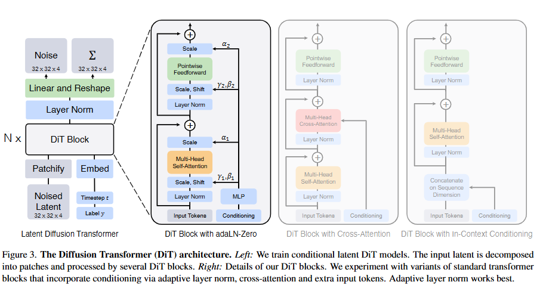
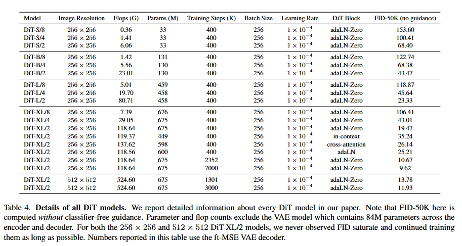
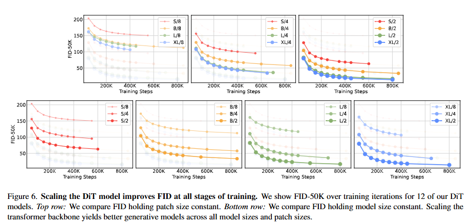
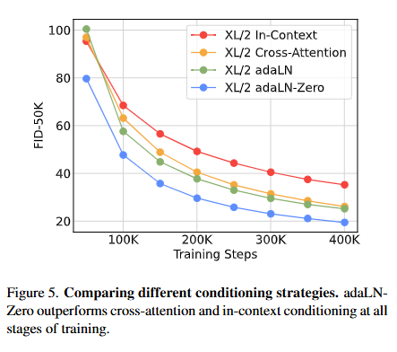
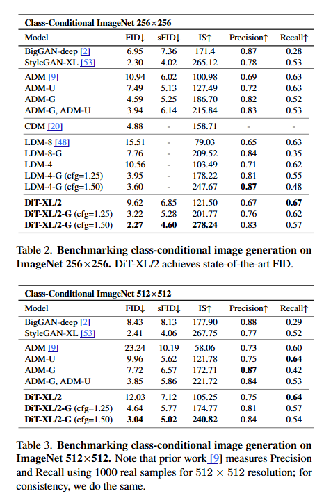

# Scalable Diffusion Models with Transformers 
This is an implementation of Diffusion Transformers, mostly trasferred from https://github.com/facebookresearch/DiT, all credits go to the authors cited below.

## Idea

The Diffusion Transformer (DiT) paper introduces a novel approach to generative modeling by leveraging the power of transformers in the context of diffusion models. The core idea is to utilize transformers, which have shown remarkable success in various domains, to enhance the scalability and performance of diffusion models. 

Diffusion models are a class of generative models that learn to generate data by reversing a diffusion process, which gradually adds noise to the data until it becomes pure noise. The model then learns to reverse this process, effectively denoising the data to generate new samples. 

The key contributions of the DiT paper include:
1. **Transformer-based Architecture**: The paper proposes a transformer-based architecture for diffusion models, which allows for better handling of complex dependencies in the data compared to traditional convolutional architectures.
2. **Scalability**: By using transformers, the model can scale to larger datasets and more complex data distributions, making it suitable for high-resolution image generation and other challenging tasks.
3. **Improved Performance**: The integration of transformers into diffusion models results in improved sample quality and diversity, as demonstrated by the experimental results in the paper.
4. **Flexibility**: The architecture is designed to be flexible, allowing for easy adaptation to different types of data and tasks, further enhancing its applicability across various domains.

Overall, the Diffusion Transformer represents a significant advancement in the field of generative modeling, combining the strengths of diffusion processes and transformer architectures to achieve state-of-the-art results.

## Available Models
The following models are available with different scales and patch sizes:

**Extra Large (XL) Models:**
- DiT-XL/2: depth=28, hidden_size=1152, patch_size=2, num_heads=16
- DiT-XL/4: depth=28, hidden_size=1152, patch_size=4, num_heads=16  
- DiT-XL/8: depth=28, hidden_size=1152, patch_size=8, num_heads=16

**Large (L) Models:**
- DiT-L/2: depth=24, hidden_size=1024, patch_size=2, num_heads=16
- DiT-L/4: depth=24, hidden_size=1024, patch_size=4, num_heads=16
- DiT-L/8: depth=24, hidden_size=1024, patch_size=8, num_heads=16

**Base (B) Models:**
- DiT-B/2: depth=12, hidden_size=768, patch_size=2, num_heads=12
- DiT-B/4: depth=12, hidden_size=768, patch_size=4, num_heads=12
- DiT-B/8: depth=12, hidden_size=768, patch_size=8, num_heads=12

**Small (S) Models:**
- DiT-S/2: depth=12, hidden_size=384, patch_size=2, num_heads=6
- DiT-S/4: depth=12, hidden_size=384, patch_size=4, num_heads=6
- DiT-S/8: depth=12, hidden_size=384, patch_size=8, num_heads=6

## Model Analysis & Results

### Model Details

### Scaling Properties

### Condition Strategies

### Generation Results

## Citation
> **Scalable Diffusion Models with Transformers**  
> *William Peebles, Saining Xie*  
> arXiv 2022 
> [[Paper]](https://arxiv.org/abs/2212.09748)

## Architecture Comparison

A comparison of three transformer-based architectures used in diffusion models: **DiT**, **UViT**, and **Masked Diffusion Transformer (MDT)**.

---

## 🧠 1. Core Architectural Philosophy

| Feature             | DiT                                  | UViT                                       | MDT                                             |
|---------------------|---------------------------------------|---------------------------------------------|--------------------------------------------------|
| Architecture        | Pure ViT (no U-Net hierarchy)         | U-Net with ViT-style transformer blocks      | Hybrid: Transformer with skip+masking            |
| Structure           | Flat transformer stack                | Symmetric encoder/decoder + mid block        | Encoder (in/out) + Decoder + side blocks         |
| Skip Connections    | ❌ None                               | ✅ Yes                                       | ✅ Yes (concat + linear projection)              |
| Mid Block           | ❌ None                               | ✅ Present                                   | ✅ Side blocks for interpolation                 |

---

## 🔲 2. Patch Embedding & Positional Encoding

| Feature              | DiT                                | UViT                                    | MDT                                               |
|----------------------|-------------------------------------|------------------------------------------|----------------------------------------------------|
| Patchify             | `PatchEmbed` with linear proj       | Same (`PatchEmbed`)                      | Same (`PatchEmbed`)                               |
| Positional Encoding  | ✅ Sinusoidal (non-trainable)       | ✅ Learnable (`pos_embed`)               | ✅ Learnable, sin-cos initialized (`pos_embed`)    |

---

## 🧠 3. Conditioning (Time + Class)

| Feature                | DiT                                          | UViT                                       | MDT                                                  |
|------------------------|-----------------------------------------------|---------------------------------------------|-------------------------------------------------------|
| Time Conditioning      | MLP + AdaLN                                   | Injected as a token (`time_token`)          | MLP + AdaLN-Zero                                     |
| Class Conditioning     | Added to `t` as `c = t + y`                   | Extra token (`label_emb`)                   | Added to `t` as `c = t + y`                          |
| Class-Free Guidance    | ✅ `forward_with_cfg()` available             | ❌ Not implemented                           | ✅ Implemented with advanced scaling (`scale_pow`)    |

---

## 🧱 4. Transformer Blocks

| Feature            | DiT                             | UViT                                     | MDT                                                    |
|--------------------|----------------------------------|-------------------------------------------|---------------------------------------------------------|
| Block Type         | `DiTBlock` with AdaLN            | `Block` with optional skip                | `MDTBlock` with AdaLN-Zero + optional skip             |
| Block Layout       | Uniform stack                    | Encoder → Mid block → Decoder             | Encoder (in/out blocks) + decoder + sideblock          |
| Attention Scope    | Global attention                 | Global attention + skip residuals         | Global attention + optional masking interpolation       |

---

## 🎭 5. Masking / Interpolation

| Feature               | DiT              | UViT              | MDT                                                      |
|-----------------------|------------------|--------------------|-----------------------------------------------------------|
| Masking Support       | ❌ None           | ❌ None             | ✅ Yes (random masking with restoration)                  |
| Mask Token            | ❌ Not used       | ❌ Not used         | ✅ Learnable mask token                                   |
| Side Interpolator     | ❌ N/A            | ❌ N/A              | ✅ Uses `sideblocks` for interpolation post-masking       |

---

## 🧩 6. Decoder & Output

| Feature             | DiT                                         | UViT                                         | MDT                                                      |
|---------------------|----------------------------------------------|-----------------------------------------------|-----------------------------------------------------------|
| Output Channels     | `in_channels` or `in_channels * 2`          | Matches input channels                        | `in_channels` or `in_channels * 2` depending on sigma     |
| Decoder             | Final linear layer + `unpatchify()`         | `decoder_pred` + `unpatchify()` + conv opt    | `FinalLayer` with AdaLN-Zero + `unpatchify()`            |
| Output Shape        | Reshaped based on patch size                | Similar                                       | Reshaped using learned patch size                         |

---

## 🧪 7. Training & Initialization

| Feature                   | DiT                                        | UViT                                          | MDT                                                      |
|---------------------------|---------------------------------------------|------------------------------------------------|-----------------------------------------------------------|
| Weight Initialization     | `xavier_uniform_`, AdaLN special init       | Mostly `normal_`, standard layernorm           | Extensive: sin-cos pos init, AdaLN-Zero zeroed layers     |
| Positional Embedding Init | Frozen sine-cosine                         | Learnable, random                             | Learnable, sin-cos initialized                            |
