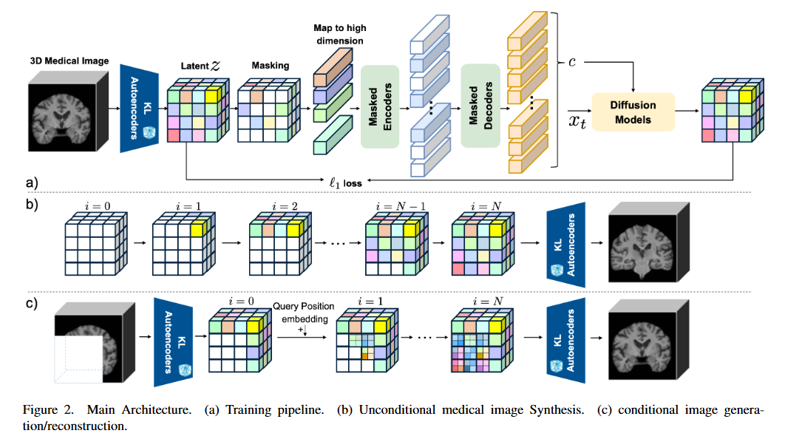
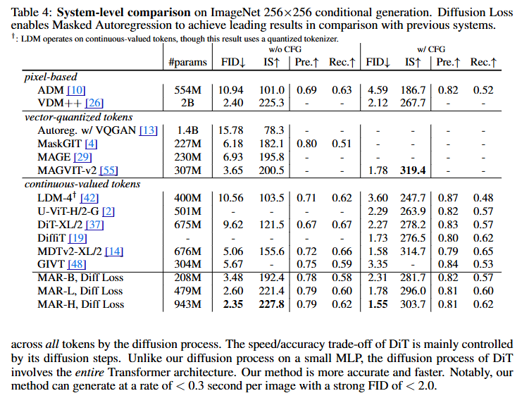
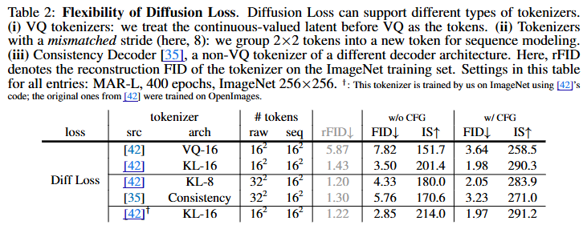
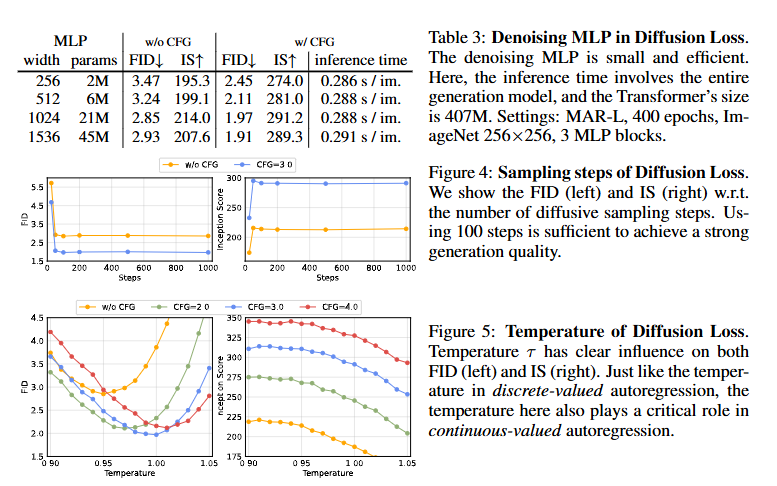
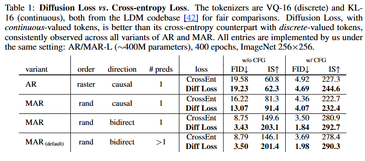
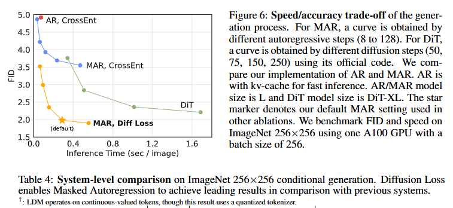

# Autoregressive Image Generation without Vector Quantization

This is an implementation of Autoregressive Image Generation without Vector Quantization

​The paper titled "Autoregressive Image Generation without Vector Quantization" introduces a novel approach that challenges the traditional reliance on vector-quantized tokens in autoregressive image generation models. The authors propose a method that operates in a continuous-valued space, eliminating the need for discrete tokenization.​

## Idea
The central idea is to model the per-token probability distribution using a diffusion process, allowing the application of autoregressive models in a continuous domain. This approach replaces the conventional categorical cross-entropy loss with a newly defined Diffusion Loss function, facilitating training without discrete tokenizers.​

Key Components:

Continuous-Valued Tokens: By operating in a continuous space, the model avoids the complexities associated with vector quantization, such as training difficulties and sensitivity to gradient approximations.​

Diffusion Loss Function: This loss function models the per-token probability distribution through a diffusion process, enabling effective training of autoregressive models in continuous spaces.​

Generalized Autoregressive Framework: The approach unifies standard autoregressive models and masked autoregressive (MAR) variants, demonstrating versatility across different model architectures.​

Performance Highlights: The proposed method achieves strong results in image generation tasks while benefiting from the speed advantages of sequence modeling. By removing vector quantization, the model simplifies the training process and enhances generation quality.​

Conclusion: This work presents a significant shift in autoregressive image generation by demonstrating that discrete tokenization is not a necessity. The introduction of Diffusion Loss opens new avenues for applying autoregressive models to continuous-valued domains, potentially impacting various applications beyond image generation.
## Available Models

The following models are available with different configurations:

**Models:**
- MAR-B: encoder_embed_dim=768, encoder_depth=12, encoder_num_heads=12, decoder_embed_dim=768, decoder_depth=12, decoder_num_heads=12
- MAR-L: encoder_embed_dim=1024, encoder_depth=16, encoder_num_heads=16, decoder_embed_dim=1024, decoder_depth=16, decoder_num_heads=16
- MAR-H: encoder_embed_dim=1280, encoder_depth=20, encoder_num_heads=16, decoder_embed_dim=1280, decoder_depth=20, decoder_num_heads=16

### Conditional Generation

### Diffusion Loss

## Citation
> **Autoregressive Image Generation without Vector Quantization**  
> *Tianhong Li, Yonglong Tian, He Li, Mingyang Deng, Kaiming He*  
> arXiv 2023 
> [[Paper]](https://arxiv.org/abs/2406.11838)

