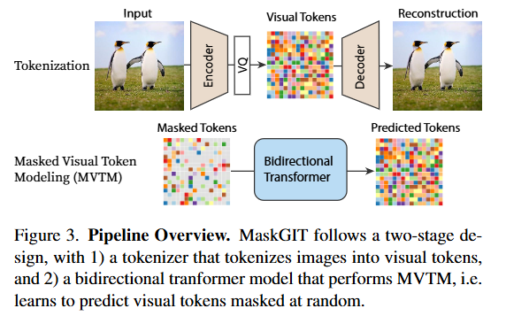
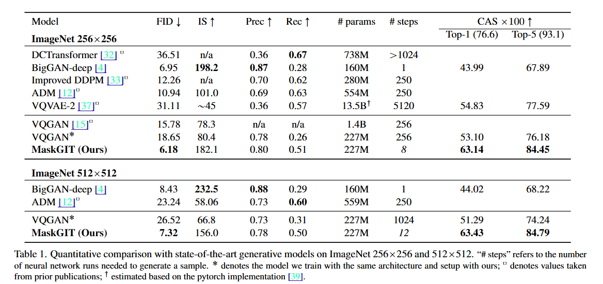
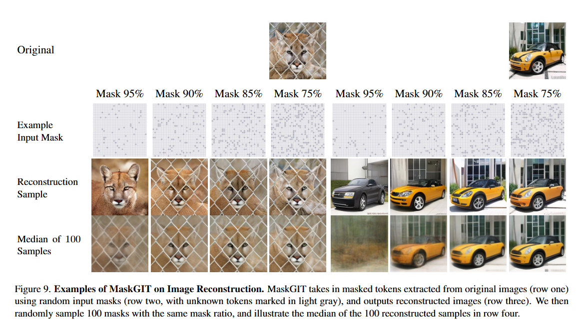
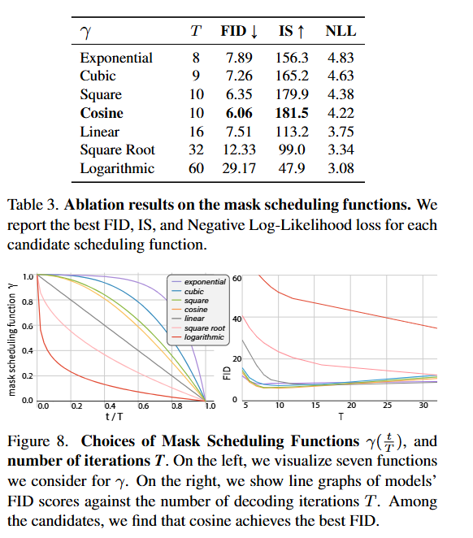

# MaskGIT: Masked Generative Image Transformer

This is an implementation of MaskGIT: Masked Generative Image Transformer 

​The paper titled "MaskGIT: Masked Generative Image Transformer" introduces a novel approach to image synthesis that significantly enhances both speed and quality compared to traditional autoregressive models. Developed by researchers at Google Research and presented at CVPR 2022, MaskGIT leverages a masked token prediction strategy combined with a bidirectional transformer architecture to generate high-fidelity images efficiently.​

## Idea
MaskGIT departs from the conventional raster-scan, token-by-token image generation by adopting a parallel decoding strategy. During training, the model learns to predict randomly masked tokens within an image by attending to all other tokens, enabling it to capture global context effectively. At inference, MaskGIT starts with all tokens masked and iteratively refines the image by predicting and unmasking tokens in multiple steps, guided by a confidence-based scheduling mechanism.

Key Components:

Bidirectional Transformer Decoder: Unlike unidirectional models, MaskGIT's decoder attends to tokens in all directions, allowing for comprehensive context utilization during token prediction.​

Masked Token Prediction: The model is trained to predict masked tokens based on the surrounding visible tokens, akin to masked language modeling in NLP, facilitating robust representation learning.​

Confidence-Based Masking Scheduler: During inference, MaskGIT employs a scheduler that selects which tokens to unmask based on the model's confidence, progressively refining the image over several iterations. 

Speed: MaskGIT achieves up to 64x faster decoding compared to traditional autoregressive models, making it highly efficient for high-resolution image generation. ​

Quality: The model demonstrates superior performance on the ImageNet dataset, achieving a Fréchet Inception Distance (FID) of 6.06 for 256×256 images and 7.32 for 512×512 images, indicating high-quality image synthesis.

Conclusion: In summary, MaskGIT presents a significant advancement in image generation by combining masked token prediction with a bidirectional transformer, resulting in faster and higher-quality image synthesis. Its versatility extends to various image editing applications, making it a valuable tool in the field of computer vision.

## Available Models

The following models are available with different configurations:

**Large (L) Models:**
- MaskGIT_L: embed_dim=1024, depth=16, num_heads=16, mlp_ratio=4, norm_layer=nn.LayerNorm

**Base (B) Models:**
- MaskGIT_B: embed_dim=768, depth=12, num_heads=12, mlp_ratio=4, norm_layer=nn.LayerNorm

**High (H) Models:**
- MaskGIT_H: embed_dim=1280, depth=20, num_heads=16, mlp_ratio=4, norm_layer=nn.LayerNorm

## Model Analysis & Results

### Generation Results

### Reconstruction

### Scheduling

## Citation
> **MaskGIT: Masked Generative Image Transformer**  
> *Huiwen Chang, Han Zhang, Lu Jiang, Ce Liu, William T. Freeman*  
> arXiv 2022 
> [[Paper]](https://arxiv.org/abs/2202.04200)

